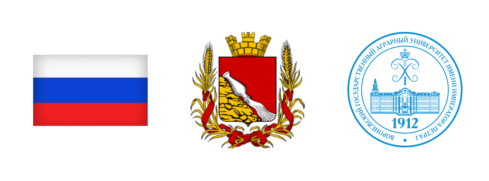

 - - -

# *Voronezh State Agricultural University*

- - -


### Frontend development repository

***

## Getting Started:

First, run the development server:

```bash
npm run dev
# or
yarn dev
# or
pnpm dev
```

## Run production server:

```bash
npm install
npm install sharp
npm run build
npm run start
```

## Tools in Project


## About Uneversity

On **June 9, 1912,** the law "On the Establishment in Voronezh" came into force
Agricultural Institute of Emperor Peter I", initiated by
The Voronezh Zemstvo, representatives of its public in
the State Council, the Government, the State Duma.
The bill, prepared by the General Directorate of Land Management and
Agriculture and approved by the Duma deputies, was submitted to the Emperor
To Nicholas II and signed by him.

## About Us

comming soon...
